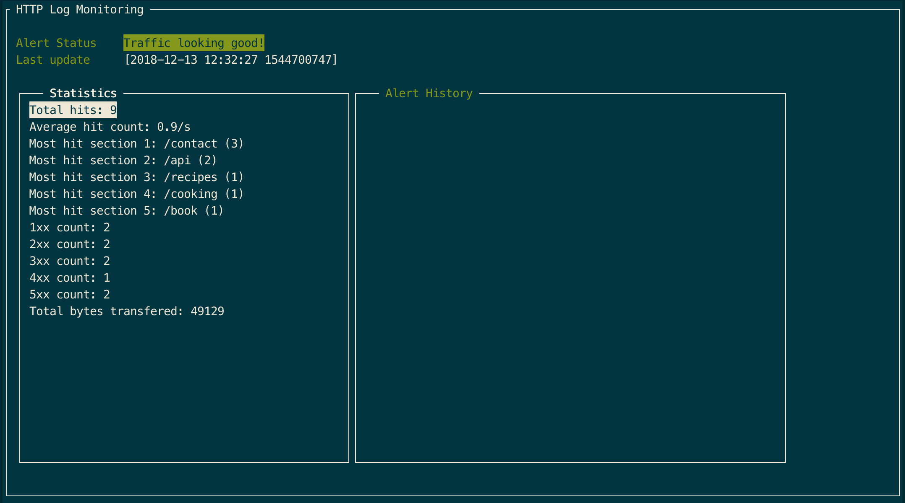
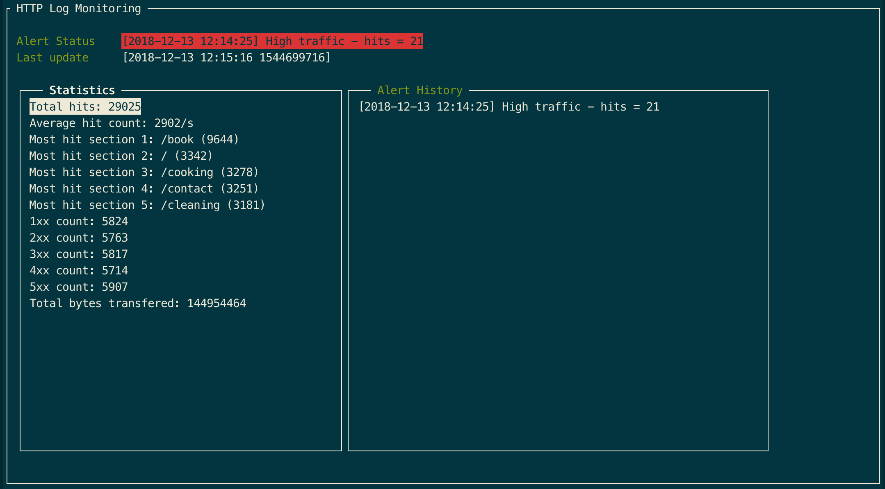
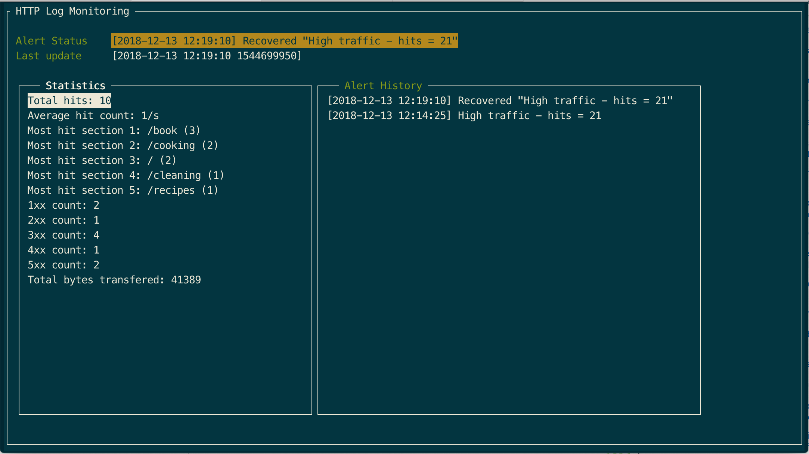
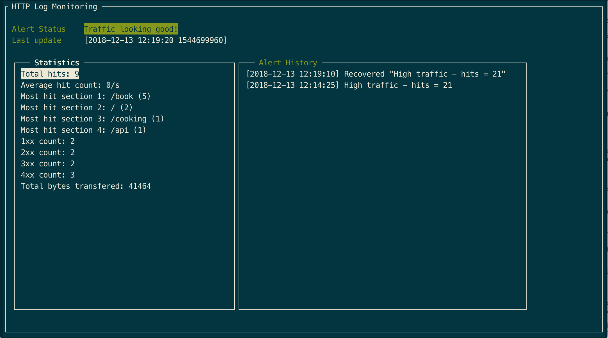
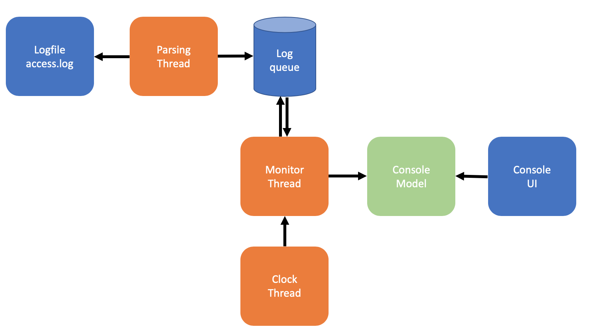

# HTTP MONITORING CONSOLE

## Introduction

This repository contains a monitoring console program that can run in a terminal. The UI contains 4 main areas:

- **Status line**, which given the color the message is highlighted gives an idea of the overall state
- **Last update line**, which gives information about the last time the UI has been updated
- **Statistics widget**, containing various information on the batch of logs processed
- **Alert history widget**, which gives the history of all alerts that occurred 

Below is demonstration of how the creen will look loke during various phases of the monitoring, starting in an state 
where the HTTP traffic is normal and then showing an alert, its recovery and how the screen looks when it goes back to 
normal.

Ok screen                  |  Alert screen  
:-------------------------:|:-------------------------:
  |   

Alert recover screen       |  Ok after alert recovered screen
:-------------------------:|:-------------------------:
  |   

## Statistics

We display every 10s (a parameter that is overridable) the following statistics:

- The total number of hits (requests)
- The average hit count per second (requests/s)
- The 5 most visited sections of the website
- The response status count of the requests
- The total number of bytes transfered

The monitoring console has been build in a way that new statistics can easily be added, by just creating a new function
in the `lib/stats.py` file, which will automatically get displayed on the console.

## Alerts

We display as often as the data refreshes (like the statistics) the following alerts:

- High traffic generated alert

This alert tells the user if an abnormal high traffic has been detected **in the last 2 minutes** (a parameter also 
overridable). To do so, the user gives a request frequency per second for the alert to trigger when launching the 
program. 

The default frequency is of **10 requests per seconds**, so whenever during the last 2 minutes the traffic was above 
10 requests per second on average, the console triggers an alarm.

Whenever the traffic drops below 10 requests per second for the last 2 minutes, we consider that the alert has 
recovered. It remains visible in the **Alert history widget**, as well as a recover message which is also added. 
The **Status line** then transition from an alert status to a recover status, to finally show an ok status.

Like for the statistics, the monitoring console has been build from the start in a way that new alerts can easily be 
added, by just creating a new function in the `lib/alerts.py` file, which will automatically get displayed on the 
console.

## Application design



The application is composed of 3 main threads (taking apart the UI thread managing the console):

- **Parsing thread**, which is responsible for continuously parsing the log file, creating log objects and putting them 
into the queue
- **Clock thread**, which is responsible for spawning Monitoring threads (frequency can be defined by the user)
- **Monitor thread**, which is the main thread retrieving in a first time the log objects, then computing statistics
and alerts to finally update the Console model

The Console Model is a core part of the application as represents the state of the application, keeps track of the 
statistics, alerts and alert history. It is decoupled from the UI object ConsoleUI in order to facilitate testing.
ConsoleUI is the main UI thread which polls continuously from the model the state for any changes to update the UI.   

#### File description

- **monitoring_console.py** - main entry point setting up the application
- **log_generator.py** - a simple script to generate fake logs, rate and file path can be configured

In the `lib/` folder:

- **app_config.py** - global configuration of the application, which is overwritten by user defined parameters
- **parser_command_line.py** - simple parser to retrieve user defined parameter in the command line
- **parser.py** - parser thread code
- **log.py** - a log representation
- **log_queue.py** - queue of logs implementation using a deque for concurrent access
- **clock.py** - a clock thread implementation spawning monitoring threads
- **monitor.py** - thread responsible for computing stats and alerts
- **stats.py** - stats functions generating stat objects
- **alerts.py** - alert functions generating alert objects
- **console.py** - console model implementation
- **console_ui.py** - terminal UI using curses

#### Testing

The logic for the alerts is tested in the file `tests/test_alerts.py`. Thanks to the decoupling of the Model and the UI,
all we have to do to create a test for the alert logic is:

1. Create a console model
2. Generate logs and add them to the queue
3. Create a monitor (the class normally passed to the thread) with the queue and the console model bind to it
4. Run the monitor
5. Make assertions based on updated state of the console model

#### Notes

During the project, some assertions have been taken into account ot focus on the core applciation:

- The timezone the log time gives us will always be UTC, which would make sense as it is the default logging behaviour
- Logs will always be well formed (although precautions for the parsing not to brake have been taken into account) 

## Running the application

The application takes 4 parameters, all optional.

```bash
Usage: python monitoring_console.py [optional arguments]
```

```
Optional arguments:
  -u, --update        update frequency in seconds (default: 10)
  -r, --retention     time interval to analyse for alerts in seconds (default: 120)
  -f, --frequency     threshold of requests/s triggering alerts (default: 10)
  -p, --path          file path to the log file (default: /var/log/access.log)
```

Example:

```bash
python monitoring_console.py --update 10 --retention 120 --frequency 10 --path /var/log/access.log
```

## Running tests

```bash
python -m unittest
```

## Running in Docker

#### Requirements

A machine with **docker** installed. To download docker, see:

- [docker installation](https://docs.docker.com/install/)

#### Build

You can build the container unsing docker build

```bash
docker build -t monitoring-console .
```

#### Running application

To launch the monitoring console as well as the log generator in the background, do the following

1. Launch a container with the generator to add logs
```
docker run --name console -it -d monitoring-console python log_generator.py --rate 100
```

2. Monitor the logs excuting the monitoring in the container
```
docker exec -it console python monitoring_console.py 
```

#### Running tests

To trigger a simple execution of the tests, use

```bash
docker run -it monitoring-console python -m unittest
```

## Future improvements

As a project is never perfect, some possible improvements would be:

- Add other means of alerts such as mails using SendGrid, text messages with Twilio or just chat messages with Slack. 
As the model is the source of truth, it should be easily extensible by giving it observables, which would be triggered 
after the model has finish updating, sending the alert using the right communication mean.

- Create tailored statistics and alerts depending on the requirements (all the monitoring now is pretty simple, the
relevance could be easily improved but the goal was to create a robust architecture)

- This application, although robust (can handle 10,000 requests/s) is not fitted for production. As the goal was to 
create a simple proof of concept, python was used but a more robust production language such as Java would have 
otherwise be preferred. Moreover, more threads and additional synchronisation should be used to scale up with demand.

- Do a full testing of the logic, especially for statistics.